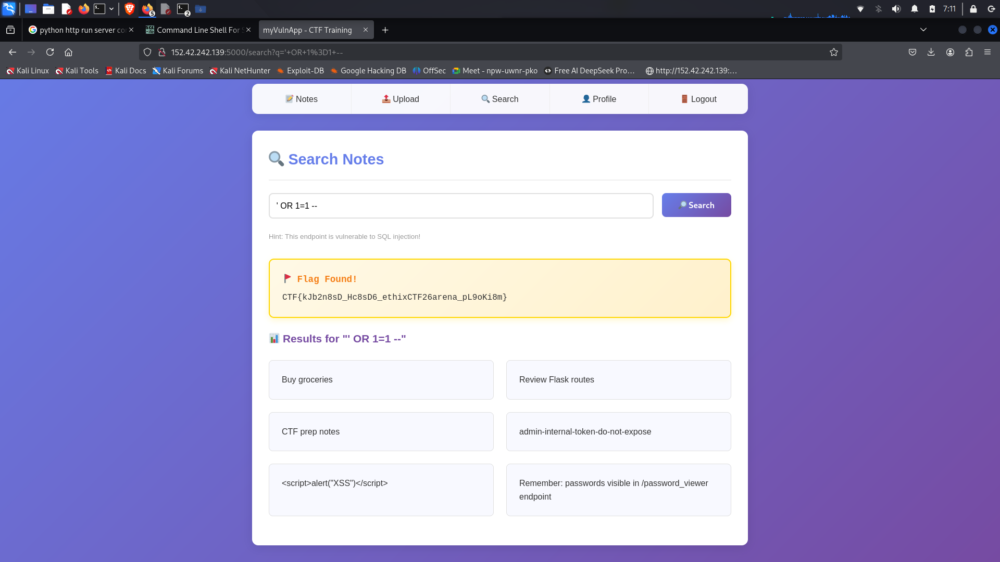

# 3. IDOR in Profile Page

## Vulnerability Discovery

While viewing our profile, we noticed the URL pattern:

`http://152.42.242.139:5000/profile/4/`

**Screenshot:** 

## Exploitation

We manually changed the ID parameter to access other users' profiles:

| URL | User ID | Username | Role |
|-----|---------|----------|------|
| `/profile/1/` | 1 | player1 | USER |
| `/profile/2/` | 2 | player2 | USER |
| `/profile/3/` | 3 | ctfadmin | ADMIN |
| `/profile/4/` | 4 | bob | USER |

**Screenshot:** 

## Flag Found

User ID 3 (ctfadmin) contained the flag:

`CTF{ek6nk8sHbdkJbr29_kfb929J_ethixCTF26arena_9isnH82}`

## Technical Explanation

The application failed to verify that the logged-in user (ID 4) was authorized to view profile ID 3. This is an **Insecure Direct Object Reference (IDOR)** vulnerability.

**Vulnerable code pattern:**
```python
@app.route('/profile/<int:user_id>')
def profile(user_id):
    user = db.query(f"SELECT * FROM users WHERE id = {user_id}")
    return render_template('profile.html', user=user)
    # Missing: check if current_user.id == user_id
```

## Impact

This vulnerability allowed us to:
- View admin profiles
- Access sensitive information
- Find hidden flags
- Map out user roles

## Prevention

Always implement access control checks:
```python
@app.route('/profile/<int:user_id>')
def profile(user_id):
    if current_user.id != user_id and current_user.role != 'ADMIN':
        return abort(403)
    # Proceed with profile display
```
