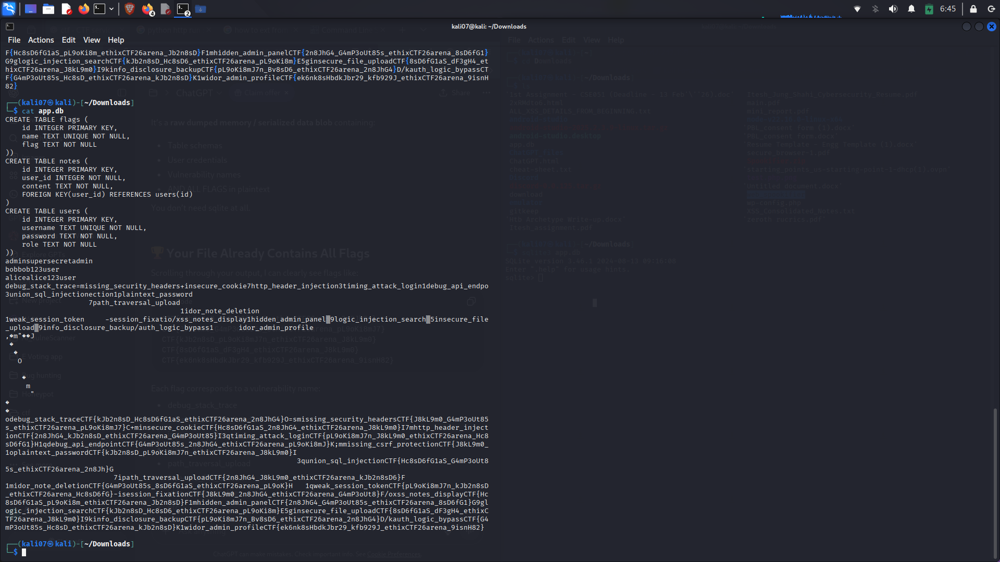

# 10. Database Exposure - The Jackpot!

## Discovery

Through path traversal vulnerabilities, we discovered and downloaded the SQLite database file:

**File:** `app.db`  
**Location:** Accessible via path traversal or direct download

**Screenshot:** 

## Database Schema

After downloading, we analyzed the database structure:

```bash
sqlite3 app.db ".schema"
```

Output:
```sql
CREATE TABLE flags (
    id INTEGER PRIMARY KEY,
    name TEXT UNIQUE NOT NULL,
    flag TEXT NOT NULL
);

CREATE TABLE notes (
    id INTEGER PRIMARY KEY,
    user_id INTEGER NOT NULL,
    content TEXT NOT NULL,
    FOREIGN KEY(user_id) REFERENCES users(id)
);

CREATE TABLE users (
    id INTEGER PRIMARY KEY,
    username TEXT UNIQUE NOT NULL,
    password TEXT NOT NULL,
    role TEXT NOT NULL
);
```

Screenshot: 

## Extracting All Flags

We ran a simple SQL query to extract all flags:
```bash
sqlite3 app.db "SELECT id, name, flag FROM flags ORDER BY id;" > allScreenshot: 

## Complete Flag List

The database contained all 20 flags:

| ID | Vulnerability Name | Flag |
|----|-------------------|------|
| 1 | debug_stack_trace | `CTF{kJb2n8sD_Hc8sD6fG1aS_ethixCTF26arena_2n8JhG4}` |
| 2 | missing_security_headers | `CTF{J8kL9m0_G4mP3oUt85s_ethixCTF26arena_pL9oKi8mJ7}` |
| 3 | insecure_cookie | `CTF{Hc8sD6fG1aS_2n8JhG4_ethixCTF26arena_J8kL9m0}` |
| 4 | http_header_injection | `CTF{2n8JhG4_kJb2n8sD_ethixCTF26arena_G4mP3oUt85}` |
| 5 | timing_attack_login | `CTF{pL9oKi8mJ7n_J8kL9m0_ethixCTF26arena_Hc8sD6fG1}` |
| 6 | debug_api_endpoint | `CTF{G4mP3oUt85s_2n8JhG4_ethixCTF26arena_pL9oKi8mJ}` |
| 7 | missing_csrf_protection | `CTF{J8kL9m0_G4mP3oUt85s_ethixCTF26arena_2n8JhG4}` |
| 8 | plaintext_password | `CTF{kJb2n8sD_pL9oKi8mJ7n_ethixCTF26arena_J8kL9m0}` |
| 9 | union_sql_injection | `CTF{Hc8sD6fG1aS_G4mP3oUt85s_ethixCTF26arena_2n8JhG}` |
| 10 | path_traversal_upload | `CTF{2n8JhG4_J8kL9m0_ethixCTF26arena_kJb2n8sD6}` |
| 11 | idor_note_deletion | `CTF{G4mP3oUt85s_8sD6fG1aS_ethixCTF26arena_pL9oK}` |
| 12 | weak_session_token | `CTF{pL9oKi8mJ7n_kJb2n8sD_ethixCTF26arena_Hc8sD6fG}` |
| 13 | session_fixation | `CTF{J8kL9m0_2n8JhG4_ethixCTF26arena_G4mP3oUt8}` |
| 14 | xss_notes_display | `CTF{Hc8sD6fG1aS_pL9oKi8m_ethixCTF26arena_Jb2n8sD}` |
| 15 | hidden_admin_panel | `CTF{2n8JhG4_G4mP3oUt85s_ethixCTF26arena_8sD6fG1}` |
| 16 | logic_injection_search | `CTF{kJb2n8sD_Hc8sD6_ethixCTF26arena_pL9oKi8m}` |
| 17 | insecure_file_upload | `CTF{8sD6fG1aS_dF3gH4_ethixCTF26arena_J8kL9m0}` |
| 18 | info_disclosure_backup | `CTF{pL9oKi8mJ7n_Bv8sD6_ethixCTF26arena_2n8JhG4}` |
| 19 | auth_logic_bypass | `CTF{G4mP3oUt85s_Hc8sD_ethixCTF26arena_kJb2n8sD}` |
| 20 | idor_admin_profile | `CTF{ek6nk8sHbdkJbr29_kfb929J_ethixCTF26arena_9isnH82}` |

Screenshot: 

## Key Finding

The database file contained ALL flags in a single table, demonstrating the critical impact of:
- Path traversal vulnerabilities
- Insufficient access controls
- Sensitive file exposure

## Prevention
- Store database files outside the web root
- Implement proper access controls
- Use environment variables for sensitive paths
- Regular security audits
